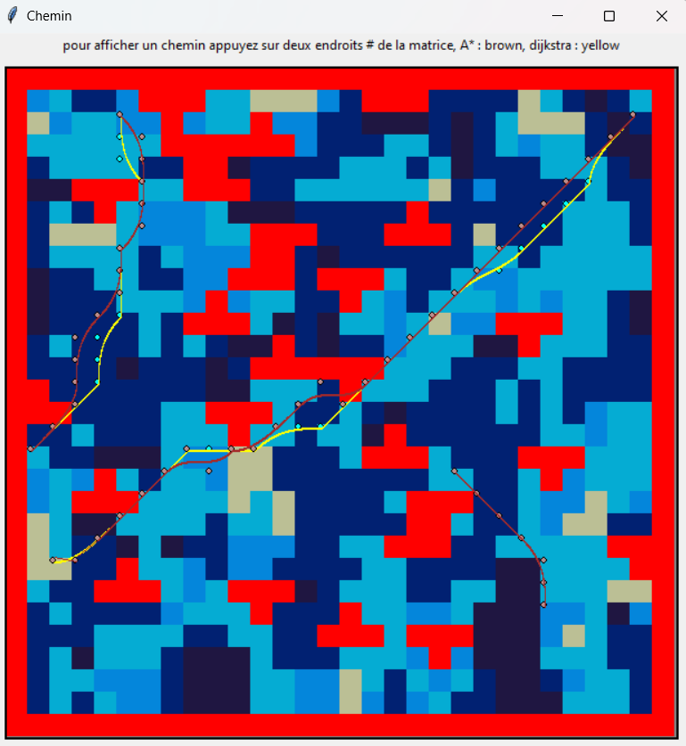

# ProjetChemin
mini projet ecrit en python qui permet de choisir sur une interface deux points, un de depart et un autre d'arrivé, et ainsi de saisir le plus court chemin 
selon deux algorithmes : dijikstra et astar, le dessin du chemin sera fait en utilisant l'algorithme bezier.

## lancement
pour tester lancer main.py

